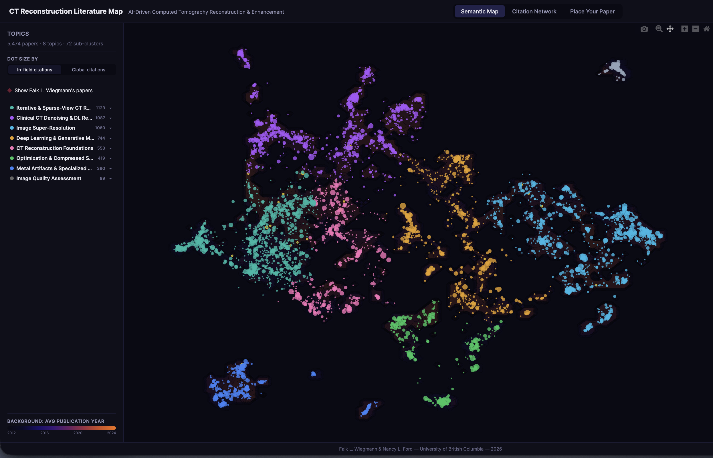
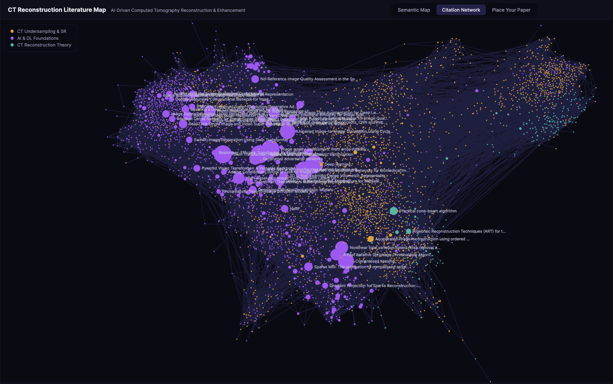

# CT-scans Image Processing Literature Map

An interactive map of ~5,000 papers in AI-driven computed tomography reconstruction and enhancement.

**[Open the live map](https://ubc-ford-lab.github.io/ct_literature_maps/)**

---

## What is this?

This is an interactive tool for exploring the research landscape of AI methods applied to CT image reconstruction — sparse-view, limited-angle, low-dose denoising, super-resolution, and the deep learning foundations behind them.

There are two views and one tool:

### Semantic Map

Papers are positioned by what they're *about*, not by who cites whom. Each paper's title and abstract were embedded into 384-dimensional vectors using a sentence transformer (all-MiniLM-L6-v2), projected to 2D with UMAP, and clustered with HDBSCAN. Papers that discuss similar topics land near each other — even if they never cite one another.

### Citation Network

The same papers, but now positioned by citation relationships. Edges show who references whom. Click any node to see its references (blue) and papers that cite it (orange).

### Place Your Paper

Paste your paper's title and abstract and the tool will embed it in your browser and show you where it falls on the map — which cluster it belongs to and which existing papers are most similar. No data is sent to any server; the embedding model runs locally via WebAssembly.

---

## How to use it

1. Go to the **[live map](https://ubc-ford-lab.github.io/ct_literature_maps/)**
2. Zoom, pan, and click papers to explore
3. Use the sidebar to filter by topic or toggle dot sizing between global and in-field citations
4. Switch between Semantic Map and Citation Network tabs
5. Click **Place Your Paper** to see where your own work fits

---

## What's covered

The map covers the intersection of medical physics and deep learning as applied to CT image formation:

- **CT Reconstruction** — sparse-view, limited-angle, few-view, iterative methods, FDK, algebraic techniques
- **CT Enhancement** — low-dose denoising, super-resolution, artifact reduction, sinogram inpainting
- **AI Foundations** — the architectures these methods build on (U-Net, GANs, diffusion models, transformers, NeRF, compressed sensing)

Papers were sourced from OpenAlex using bidirectional citation traversal from 43 seed papers, plus keyword-targeted discovery searches. Coverage of the core field is estimated at ~90% with all the important papers definitely included.

---

## Citation

If you use this tool or the underlying dataset in your work, please cite:

> Wiegmann, F.L. & Ford, N.L. (2026). CT Reconstruction Literature Map. University of British Columbia. https://ubc-ford-lab.github.io/ct_literature_maps/

---

## Built by

Falk L. Wiegmann & Nancy L. Ford  
University of British Columbia  
2026
